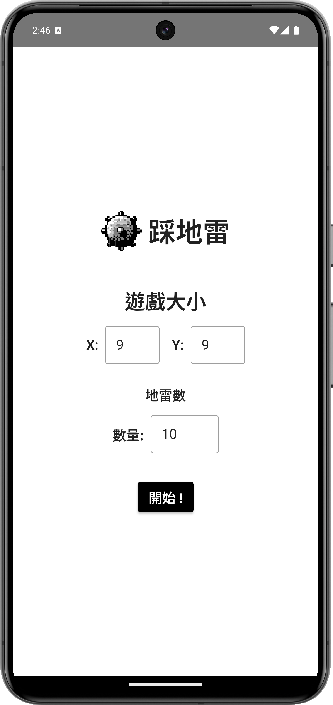
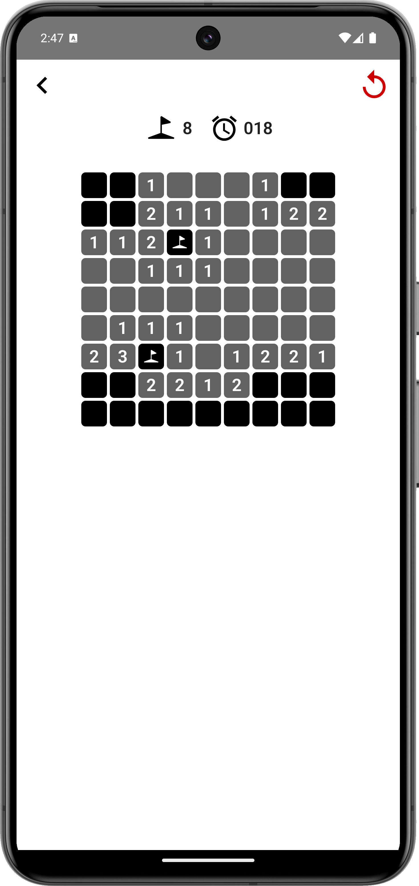
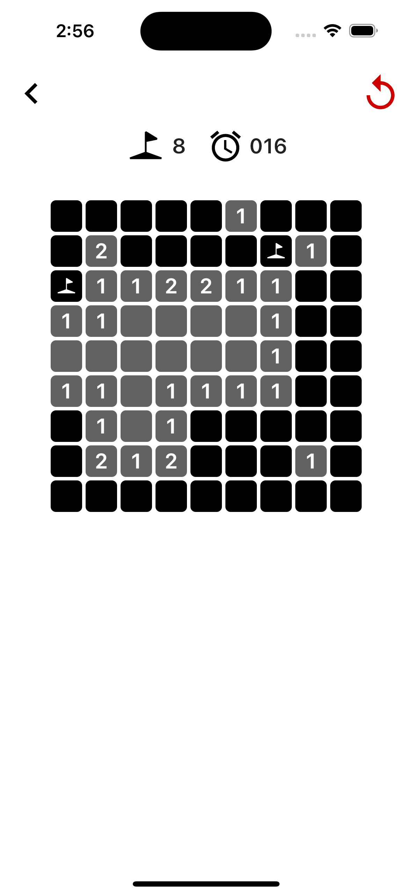

# Minesweeper

## 專案介紹

就是個踩地雷遊戲，可運行在Android及IOS環境上。

該專案是使用**Kotlin Multiplatform**框架開發的範例專案，可參考該專案有引用套件、目錄結構及撰寫架構來學習如何撰寫一個基本的雙平台APP。

## 使用套件及開發框架

* [**Kotlin Multiplatform**](https://kotlinlang.org/docs/multiplatform.html) - 可用jetpack
  compose開發多平台開發框架。
* [**Decompose**](https://github.com/arkivanov/Decompose) - 簡化compose可以將ui及邏輯代碼分離，並優化了頁面導向及生命週期綁定。
* [**Compottie**](https://github.com/alexzhirkevich/compottie) - compose使用Lottie動畫的引擎。
* [**Room (Kotlin Multiplatform)**](https://developer.android.com/kotlin/multiplatform/room?hl=zh-tw) - Kotlin Multiplatform用sqlite orm框架，可參考Android room。

## 目錄結構

* **androidApp** - Android app專案目錄
* **gradle** - gradle資源
    * **libs.versions.toml** - 引用第三方程式庫資訊
* **iosApp** - Ios app專案目錄
* **shared** - compose共用資源目錄
    * **androidMain** - Android compose用程式目錄
    * **commonMain** - 共用compose程式目錄
        * **composeResources** - compose共用資源
        * **kotlin** - 共用compose程式
    * **iosMain** - Ios compose用程式目錄

## 畫面預覽

### Android

|  |  |
|:--------------------------------:|:---------------------------------:|

### Ios

|  |  |
|:----------------------------:|:-----------------------------:|
